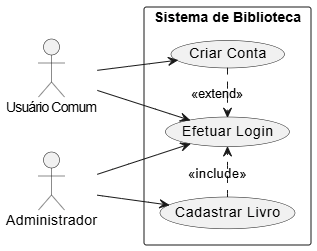

# Documentação do Projeto - Gestão de Biblioteca

## 1. Descrição e Delimitação do Escopo

**Cenário do Sistema**
O sistema de Gestão de Biblioteca é uma aplicação desktop desenvolvida para informatizar e modernizar o controle de acervos e empréstimos literários. O propósito principal é substituir controles manuais ou planilhas descentralizadas por uma plataforma unificada que garanta a integridade dos dados e o controle de acesso.

O público-alvo é dividido em duas categorias: administradores (bibliotecários ou gestores) e leitores comuns. O sistema resolve o problema da falta de rastreabilidade do acervo, impedindo a perda de livros e centralizando o histórico de quem está em posse de qual obra, além de restringir ações críticas (como alterar o catálogo) apenas a funcionários autorizados.

As principais funcionalidades contemplam o controle de acesso seguro (login), o cadastro e manutenção de usuários, o gerenciamento do acervo de livros (cadastro, edição, exclusão e listagem) e o fluxo completo de empréstimos, desde a retirada até a devolução.

---

## 2. Fase de Análise

### a) Requisitos Funcionais
Abaixo estão detalhadas as funcionalidades diretas que o sistema fornecerá aos seus usuários:

* **RF01:** O sistema deve permitir o cadastro de usuários contendo nome, cpf, login, senha e tipo de permissão (administrador ou comum).
* **RF02:** O sistema deve autenticar o acesso do usuário exigindo um login e uma senha válidos cadastrados no banco de dados.
* **RF03:** O sistema deve adaptar a interface gráfica de acordo com o nível de permissão do usuário logado, ocultando ou exibindo menus específicos.
* **RF04:** O sistema deve permitir que usuários administradores cadastrem novos livros informando o título e o autor da obra.
* **RF05:** O sistema deve permitir que usuários administradores editem as informações dos livros já cadastrados.
* **RF06:** O sistema deve permitir que usuários administradores excluam livros do acervo.
* **RF07:** O sistema deve permitir a listagem de todos os livros cadastrados, incluindo uma funcionalidade de busca.
* **RF08:** O sistema deve permitir o registro de um novo empréstimo, vinculando um usuário a um livro e informando a data de retirada e a data de devolução prevista.
* **RF09:** O sistema deve permitir a atualização do status de um empréstimo para registrar a devolução de um livro.
* **RF10:** O sistema deve exibir uma tela "Sobre" contendo informações gerais do software e do desenvolvedor.

### b) Requisitos Não Funcionais
Abaixo estão as restrições técnicas, de qualidade e de arquitetura que o sistema deve respeitar:

* **RNF01 (Arquitetura):** O sistema deve ser implementado na linguagem Python, respeitando a separação de responsabilidades do padrão arquitetural MVC (Model-View-Controller).
* **RNF02 (Persistência):** Os dados devem ser obrigatoriamente persistidos em um banco de dados relacional PostgreSQL, utilizando a biblioteca SQLAlchemy para o mapeamento e comunicação.
* **RNF03 (Interface):** A aplicação deve possuir uma Interface Gráfica de Usuário (GUI) desenvolvida utilizando a biblioteca Tkinter.
* **RNF04 (Design Patterns):** A estruturação do código deve aplicar obrigatoriamente o padrão de projeto Data Access Object (DAO) para o acesso a dados e o padrão Strategy para o gerenciamento de permissões de interface.
* **RNF05 (Validação):** O sistema deve garantir a unicidade de registros críticos no banco de dados, não permitindo o cadastro de CPFs ou logins duplicados.

### c) Regras de Negócio
Abaixo estão as restrições lógicas e operacionais específicas do domínio da biblioteca:

* **RN01:** Um livro não pode ser excluído do sistema se possuir um registro de empréstimo ativo vinculado a ele, garantindo a integridade referencial do histórico no banco de dados.
* **RN02:** O sistema deve garantir que o botão e a funcionalidade de "Cadastrar Livro" sejam absolutamente inacessíveis para usuários que tenham efetuado login com o perfil "comum".

## 2. Casos de Uso

### Diagramas de Casos de Uso

### Efetuar Login

| Nome do Caso de Uso | Efetuar Login |
| :--- | :--- |
| **Ator Principal** | Usuário Comum, Administrador |
| **Atores Secundários** | Nenhum |
| **Resumo** | Processo de autenticação obrigatório para identificação do utilizador. |
| **Pré-condições** | O utilizador deve possuir registo ativo na base de dados. |
| **Pós-condições** | Sessão iniciada com as permissões adequadas ativas na interface. |
| **Cenário Principal** | |
| **Ações do Ator** | **Ações do Sistema** |
| 1. Inserir as credenciais de acesso. | 2. Validar as informações inseridas. |
| | 3. Identificar o tipo de utilizador (Comum ou Administrador). |
| | 4. Libertar o acesso correspondente na interface. |
---

### UC06 - Cadastrar Livro

| Nome do Caso de Uso | UC06 – Cadastrar Livro |
| :--- | :--- |
| **Ator Principal** | Administrador |
| **Atores Secundários** | Nenhum |
| **Resumo** | Inclusão de novas obras ao banco de dados e atualização do catálogo da biblioteca. |
| **Pré-condições** | O administrador deve possuir os dados da nova obra e ter os devidos privilégios de acesso. |
| **Pós-condições** | Novo livro adicionado ao acervo e disponível para locação. |
| **Cenário Principal** | |
| **Ações do Ator** | **Ações do Sistema** |
| 1. Clicar em "Cadastrar Novo Livro". | 2. Abrir o formulário de inserção de obras. |
| 3. Preencher título, autor e quantidade e submeter. | 4. Validar os campos e persistir os dados na base de dados. |
| | 5. Atualizar a tabela principal do acervo. |
| **Fluxo de Inclusão (<<include>>)** | |
| **Ações do Ator** | **Ações do Sistema** |
| | 1. Para executar este caso de uso, o sistema exige obrigatoriamente a execução prévia do **UC01 - Efetuar Login**. |

---

### Criar Conta

| Nome do Caso de Uso | Criar Conta |
| :--- | :--- |
| **Ator Principal** | Usuário Comum |
| **Atores Secundários** | Nenhum |
| **Resumo** | Permite que um novo utilizador se registe no sistema. Este caso de uso atua como uma extensão do Login, sendo uma opção alternativa caso o utilizador não possua cadastro. |
| **Pré-condições** | O utilizador não possuir conta no sistema. |
| **Pós-condições** | Nova conta de utilizador criada e registada na base de dados. |
| **Cenário Principal** | |
| **Ações do Ator** | **Ações do Sistema** |
| 1. Na tela de login, selecionar "Criar Conta". | 2. Apresentar o formulário de registo. |
| 3. Preencher os dados pessoais e submeter. | 4. Validar e persistir os dados na base de dados. |
| **Fluxo de Extensão (<<extend>>)** | |
| **Ações do Ator** | **Ações do Sistema** |
| | 1. Este caso de uso estende o **Efetuar Login**, atuando como um fluxo alternativo opcional acionado a partir da interface de autenticação. |

---

### Alugar Livro

| Nome do Caso de Uso | Alugar Livro |
| :--- | :--- |
| **Ator Principal** | Usuário Comum |
| **Atores Secundários** | Nenhum |
| **Resumo** | Processo de requisição e locação de um livro selecionado no acervo da biblioteca. |
| **Pré-condições** | O livro selecionado possuir quantidade maior que zero em stock. |
| **Pós-condições** | O inventário é atualizado e o empréstimo é registado no histórico do utilizador. |
| **Cenário Principal** | |
| **Ações do Ator** | **Ações do Sistema** |
| 1. Selecionar um livro na tabela do acervo. | |
| 2. Clicar em "Alugar Livro Selecionado". | 3. Registar a associação entre o ID do livro e o ID do utilizador. |
| | 4. Decrementar a quantidade disponível do livro. |
| | 5. Exibir mensagem de sucesso. |
| **Fluxo de Inclusão (<<include>>)** | |
| **Ações do Ator** | **Ações do Sistema** |
| | 1. Para executar este caso de uso, o sistema exige obrigatoriamente a execução prévia do **Efetuar Login**. |